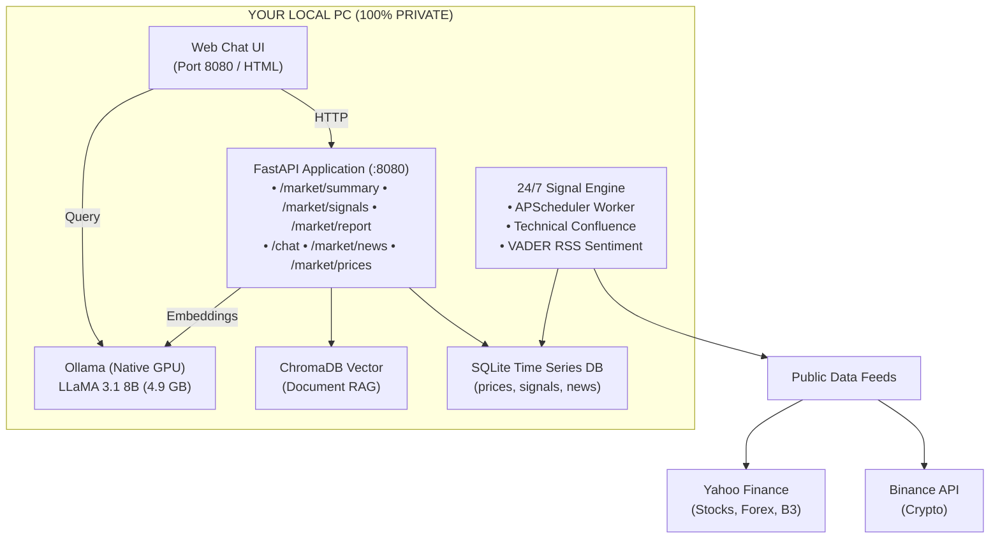
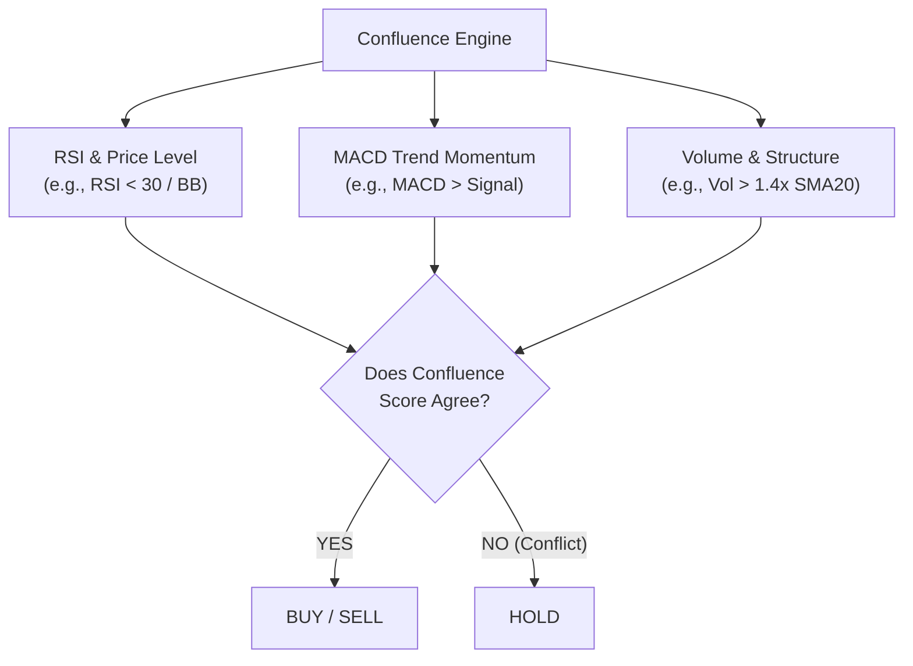

# Finance AI Quantitative Market Signal & Local Advisory System

A **100% self-hosted, offline, and zero-cost financial intelligence suite** combining a **24/7 quantitative indicator scanner** with a **private local LLM financial advisor (LLaMA 3.1 8B)**. 

Runs entirely on consumer hardware (tested on an **AMD Ryzen 7 5700X3D + NVIDIA RTX 4060 8GB**). Zero third-party API costs, zero cloud subscriptions, zero data leaks.

---

## Table of Contents

- [Overview & Philosophy](#-overview--philosophy)
- [System Architecture](#-system-architecture)
- [The Two-Brain Architecture](#-the-two-brain-architecture)
- [Core Features](#-core-features)
- [Quantitative Indicator Methodology](#-quantitative-indicator-methodology)
  - [1. Relative Strength Index (RSI)](#1-relative-strength-index-rsi)
  - [2. Moving Average Convergence Divergence (MACD)](#2-moving-average-convergence-divergence-macd)
  - [3. Bollinger Bands (BB)](#3-bollinger-bands-bb)
  - [4. Trend EMAs & Volume Anomalies](#4-trend-emas--volume-anomalies)
  - [5. Confluence Matrix (Why HOLD on Oversold?)](#5-confluence-matrix-why-hold-on-oversold)
- [NLP News Sentiment Engine](#-nlp-news-sentiment-engine)
- [Tracked Asset Coverage](#-tracked-asset-coverage)
- [Project Directory Structure](#-project-directory-structure)
- [Hardware & Software Prerequisites](#-hardware--software-prerequisites)
- [Quick Start Installation (Windows)](#-quick-start-installation-windows)
- [Interactive Web Dashboard](#-interactive-web-dashboard)
- [REST API Reference](#-rest-api-reference)
- [Alert Setup (Telegram & Email)](#-alert-setup-telegram--email)
- [Customization & Adding Assets](#-customization--adding-assets)
- [Frequently Asked Questions (FAQ)](#-frequently-asked-questions-faq)
- [Disclaimer & License](#-disclaimer--license)

---

## Overview & Philosophy

Most commercial financial AI products charge recurring monthly subscriptions ($20–$100/mo) or per-token API fees while routing your private portfolio data through external corporate servers. Furthermore, pure language models (like raw ChatGPT or Claude) cannot reliably track live numerical prices or perform rapid statistical calculus across thousands of financial candles.

**Finance AI solves both problems by separating math from language:**

1. **The Quantitative Engine:** A lightweight, high-performance background daemon that pulls 5-minute candle data, computes technical indicator calculus via vectorized Pandas/NumPy, and evaluates rule-based confluence voting.
2. **The AI Advisory Engine:** An offline, GPU-accelerated large language model (**LLaMA 3.1 8B** via **Ollama**) that ingests the quantitative engine's findings and synthesizes plain-English market briefs, answers ad-hoc questions, and assesses trade risk.

---

## System Architecture

---

## The Two-Brain Architecture

| Feature | The Quantitative Engine | The AI Advisor (LLaMA 3.1) |
| :--- | :--- | :--- |
| **Role** | Data collection, statistics, indicator calculus | Reasoning, natural language synthesis, strategy |
| **Frequency** | Every 5 minutes (continuous 24/7 background) | On-demand (when you ask or generate a report) |
| **Resource Usage**| ~0.1% CPU, minimal RAM | Active only during inference on NVIDIA GPU |
| **Output** | Numerical metrics, JSON signals, confidence % | Formatted executive briefings, conversational answers |
| **Speed** | Sub-second across 24 assets | ~20 tokens/sec on RTX 4060 |

---

## Core Features

- **Multi-Market Scanning**: Live tracking across US Mega-Cap Tech, S&P 500 / NASDAQ ETFs, Cryptocurrencies, Major Forex pairs, and Brazilian Equities (B3).
- **Rule-Based Confluence Voting**: Replaces emotional trading with a strict multi-indicator agreement matrix.
- **Deduplicated Signal Pipeline**: View the latest live state of all assets at a glance without clutter.
- **Falling Knife Protection**: Automatically holds back on BUY signals when momentum is still collapsing, even if RSI is deeply oversold.
- **VADER News Sentiment Analysis**: Continuously scans financial RSS feeds (Reuters, Yahoo Finance, CoinDesk, InfoMoney) and calculates real-time market sentiment (-1.0 to +1.0).
- **One-Click AI Executive Briefings**: Instantly prompts local LLaMA 3.1 to synthesize technical data into a strategic market report.
- **Instant Push Alerts**: Supports automated dispatch of high-conviction trade alerts to **Telegram** and **Email (SMTP)**.
- **Zero-Dependency Native Mode**: Runs directly on Windows with Python and SQLite—no WSL or Docker virtualization required.

---

## Quantitative Indicator Methodology

### 1. Relative Strength Index (RSI)
Calculated using a 14-period exponential smoothing formula:

```math
\text{RSI} = 100 - \left( \frac{100}{1 + \text{RS}} \right)
```

Where:
```math
\text{RS} = \frac{\text{Average Gain}}{\text{Average Loss}}
```
over the last 14 five-minute candles.
- **RSI < 30:** Asset is **Oversold** (heavy liquidation, potential discount).
- **RSI > 70:** Asset is **Overbought** (speculative euphoria, high risk of reversal).

### 2. Moving Average Convergence Divergence (MACD)
Calculated using standard 12-period fast EMA and 26-period slow EMA:

```math
\text{MACD Line} = \text{EMA}_{12}(\text{Close}) - \text{EMA}_{26}(\text{Close})
```
```math
\text{Signal Line} = \text{EMA}_{9}(\text{MACD Line})
```
```math
\text{Histogram} = \text{MACD Line} - \text{Signal Line}
```

- **MACD > Signal Line & Histogram > 0:** Bullish momentum accelerating.
- **MACD < Signal Line & Histogram < 0:** Bearish momentum accelerating.

### 3. Bollinger Bands (BB)
Measures statistical volatility using a 20-period Simple Moving Average and $\pm 2$ standard deviations ($\sigma$):

```math
\text{Upper Band} = \text{SMA}_{20} + (2 \times \sigma_{20})
```
```math
\text{Lower Band} = \text{SMA}_{20} - (2 \times \sigma_{20})
```

When price tags the lower band, it is trading at a statistical outlier discount ($z \le -2.0$).

### 4. Trend EMAs & Volume Anomalies
- **EMA Alignment:** Evaluates short-term momentum by comparing $\text{EMA}_9$ against $\text{EMA}_{21}$, and long-term trend against $\text{EMA}_{50}$ / $\text{EMA}_{200}$.
- **Volume Ratio:** Flags volume surges where $\text{Volume} \ge 1.4 \times \text{SMA}_{20}(\text{Volume})$, confirming that institutional volume supports the price action.

### 5. Confluence Matrix (Why HOLD on Oversold?)
The engine requires **multi-factor confirmation** before issuing actionable trade signals:



* **Example:** If Bitcoin's RSI hits **21.7** (heavily oversold), but the MACD histogram is negative and dropping, the system refuses to buy. It issues a **`HOLD`** to prevent entering a cascading drop. It upgrades to **`BUY`** only once momentum flattens or curls upward.

---

## NLP News Sentiment Engine

Every 15 minutes, the sentiment engine parses global financial news feeds:
- **Global / US:** Yahoo Finance RSS, Investing.com
- **Crypto:** CoinDesk, Cointelegraph
- **Brazil (B3):** InfoMoney, Folha Mercado

Headlines are processed through the **VADER (Valence Aware Dictionary and sEntiment Reasoner)** NLP pipeline to generate a normalized compound polarity score:
- **Compound Score > +0.05:** Categorized as **Bullish** 🟢
- **Compound Score < -0.05:** Categorized as **Bearish** 🔴
- **-0.05 to +0.05:** Categorized as **Neutral** ⚪

---

## Tracked Asset Coverage

The default seed watchlist monitors **24 assets** across four major market classes:

| Category | Assets Monitored | Data Source |
| :--- | :--- | :--- |
| **US Equities & ETFs** | `AAPL`, `MSFT`, `NVDA`, `TSLA`, `AMZN`, `GOOGL`, `META`, `SPY`, `QQQ` | Yahoo Finance |
| **Cryptocurrencies** | `BTCUSDT`, `ETHUSDT`, `SOLUSDT`, `BNBUSDT`, `XRPUSDT`, `ADAUSDT`, `DOGEUSDT` | Binance Public API |
| **Forex Pairs** | `EURUSD=X`, `GBPUSD=X`, `USDJPY=X` | Yahoo Finance |
| **Brazilian Stocks (B3)** | `PETR4.SA`, `VALE3.SA`, `ITUB4.SA`, `BBDC4.SA`, `ABEV3.SA` | Yahoo Finance |

---

## Project Directory Structure

```text
finance-ai/
├── alerts/
│   ├── __init__.py
│   ├── email_alerts.py          # SMTP HTML trade alert dispatcher
│   └── telegram_bot.py          # Telegram Bot API alert dispatcher
├── api/
│   ├── __init__.py
│   ├── finance_tools.py         # Transaction categorization & budgeting
│   ├── main.py                  # FastAPI server & route handlers
│   └── models.py                # Pydantic data validation schemas
├── data/
│   ├── finance.db               # SQLite database (auto-created on first run)
│   ├── uploads/                 # Storage for user financial documents
│   └── vectordb/                # ChromaDB vector embedding storage
├── frontend/
│   └── index.html               # Responsive single-page dashboard & chat UI
├── prompts/
│   └── system_prompt.md         # System instructions for LLaMA 3.1 advisor
├── rag/
│   ├── __init__.py
│   ├── embeddings.py            # Ollama nomic-embed-text wrapper
│   ├── ingest.py                # Document chunking & vectorization
│   └── retriever.py             # Vector similarity search
├── signal_engine/
│   ├── __init__.py
│   ├── backtester.py            # Historical win rate calculations
│   ├── database.py              # SQLite CRUD operations
│   ├── data_fetcher.py          # Multi-market price data scraper
│   ├── main.py                  # Standalone worker daemon entrypoint
│   ├── models.py                # Shared dataclasses & enums
│   ├── scheduler.py             # APScheduler background task manager
│   ├── sentiment.py             # VADER news sentiment analyzer
│   └── technical_analysis.py    # Vectorized indicator math (pure Pandas/NumPy)
├── .env.example                 # Configuration template
├── Dockerfile.api               # Optional Docker container for API
├── Dockerfile.signal            # Optional Docker container for worker
├── docker-compose.yml           # Optional Docker deployment
├── requirements.txt             # Python package dependencies
├── run_local.py                 # Primary Windows Python runner
├── run.bat                      # One-click Windows batch launcher
└── README.md                    # System documentation
```
---

## Hardware & Software Prerequisites

- **Operating System:** Windows 10/11, macOS, or Linux
- **Python:** Version 3.10 to 3.14
- **Ollama:** Installed from [ollama.com](https://ollama.com) (runs in background tray)
- **Recommended GPU:** NVIDIA GPU with 8GB+ VRAM (e.g. RTX 3060/4060/4070 or better) for rapid inference (~20 tokens/sec). CPU inference is supported automatically as fallback.

---

## Quick Start Installation (Windows)

### 1. Clone the Repository
```bash
git clone https://github.com/your-username/finance-ai.git
cd finance-ai
```

### 2. Install Python Dependencies
```bash
py -m pip install -r requirements.txt
```

### 3. Pull the Local AI Model
Ensure Ollama is running, then pull the model:
```bash
ollama pull llama3.1:8b
```

### 4. Launch the System
Double-click **`run.bat`** or run:
```cmd
.
un.bat
```
*(Or via PowerShell: `py run_local.py`)*

The system will:
1. Initialize the SQLite database and seed the default watchlist.
2. Spin up the background 24/7 market & sentiment scanner thread.
3. Start the FastAPI server on `http://localhost:8080`.
4. Automatically open your browser to the Web Dashboard!

---

## Interactive Web Dashboard

Access the dashboard at **`http://localhost:8080`**:

- **Real-Time Summary Bar:** Shows total assets tracked, current count of active BUY/SELL signals, and market-wide news sentiment score.
- **Confluence Table:** Displays each asset with its live price, actionable signal pill (`STRONG BUY`, `BUY`, `HOLD`, `SELL`), color-coded RSI badge, confidence meter, and individual indicator rationale tags.
- **Market Filters:** One-click filtering between `All`, `Crypto`, `US Tech`, `B3 Brazil`, and `Forex`.
- **Built-in Signal Guide:** Click **"Signal Guide"** in the top navigation bar to open a collapsible tutorial on RSI, MACD, and confluence mechanics.
- **AI Executive Brief:** Click **"AI Market Brief"** to have LLaMA 3.1 synthesize all current signals into a structured market analysis.
- **GPU Advisor Chat:** Chat directly with your local LLM about any stock, indicator reading, or macroeconomic event.

---

## REST API Reference

The interactive Swagger documentation is available at **`http://localhost:8080/docs`**.

### Key Endpoints

| Method | Endpoint | Description |
| :--- | :--- | :--- |
| `GET` | `/market/summary` | Aggregated counts of BUY/SELL/HOLD signals & news sentiment |
| `GET` | `/market/signals` | List deduplicated live signals (`latest_only=true`) or historical signals |
| `GET` | `/market/news` | Recent financial headlines tagged with VADER sentiment |
| `GET` | `/market/watchlist` | View all active assets being monitored |
| `POST`| `/market/watchlist` | Add a new ticker to the continuous 24/7 scanning cycle |
| `DELETE`| `/market/watchlist/{symbol}`| Remove an asset from the scanning cycle |
| `GET` | `/market/prices/{symbol}` | Fetch raw OHLCV price history for charting |
| `POST`| `/market/report` | Trigger local LLM to generate an executive market report |
| `POST`| `/chat` | Conversational endpoint connecting user queries with market data & LLaMA |

---

## Alert Setup (Telegram & Email)

Copy `.env.example` to `.env`:
```powershell
Copy-Item .env.example .env
```

### 1. Telegram Push Notifications
1. Message **@BotFather** on Telegram and send `/newbot` to create your alert bot.
2. Copy the bot token into your `.env`:
   ```env
   TELEGRAM_BOT_TOKEN=123456789:ABCdefGHIjklMNOpqrSTUvwxYZ
   ```
3. Send any message to your new bot, then visit:
   `https://api.telegram.org/bot<YOUR_TOKEN>/getUpdates`
4. Copy the `"id"` value from the `"chat"` object and add it to `.env`:
   ```env
   TELEGRAM_CHAT_ID=987654321
   ```

### 2. Gmail SMTP Alerts
1. In your Google Account, enable **2-Factor Authentication**.
2. Navigate to **Security -> App Passwords** and generate a password for "Mail".
3. Update `.env`:
   ```env
   ALERT_EMAIL_TO=your-email@gmail.com
   SMTP_HOST=smtp.gmail.com
   SMTP_PORT=587
   SMTP_USER=your-email@gmail.com
   SMTP_PASSWORD=your-16-char-app-password
   ```

---

## Customization & Adding Assets

### Add a Ticker via the API
You can add any stock, crypto, or currency pair dynamically:

```bash
curl -X POST http://localhost:8080/market/watchlist   -H "Content-Type: application/json"   -d '{
    "symbol": "AMD",
    "market": "us_stocks",
    "display_name": "Advanced Micro Devices"
  }'
```

- For **US Stocks & ETFs**: Use standard ticker symbols (e.g. `AMD`, `COIN`, `VOO`).
- For **Crypto**: Use Binance USDT pairs (e.g. `AVAXUSDT`, `LINKUSDT`).
- For **Forex**: Use Yahoo currency format (e.g. `AUDUSD=X`).
- For **Brazilian Stocks**: Append `.SA` (e.g. `WEGE3.SA`, `MGLU3.SA`).

---

## Frequently Asked Questions (FAQ)

#### Q: Will running this system slow down my PC while gaming or working?
**A:** No. The quantitative engine runs lightweight math every 5 minutes using negligible CPU (~0.1%). The LLaMA 3.1 model only loads into GPU VRAM when you actively submit a chat question or click "AI Market Brief", leaving your GPU completely free the rest of the time.

#### Q: Can I run this without an NVIDIA GPU?
**A:** Yes. Ollama automatically falls back to CPU mode if no compatible NVIDIA CUDA GPU is detected. It will run slightly slower, but is fully functional.

#### Q: Are any external API keys required to start?
**A:** No. Out of the box, data is pulled using free public endpoints from Yahoo Finance and Binance. Telegram, Email, and Alpha Vantage keys are strictly optional.

---

## Disclaimer

### Disclaimer
> **IMPORTANT:** This software is an experimental quantitative analytics platform designed for educational, research, and informational purposes only. It **does not constitute financial, investment, legal, or tax advice**. Technical indicators and past performance are no guarantee of future market returns. Always conduct your own independent research and consult a licensed financial advisor before making investment decisions.


